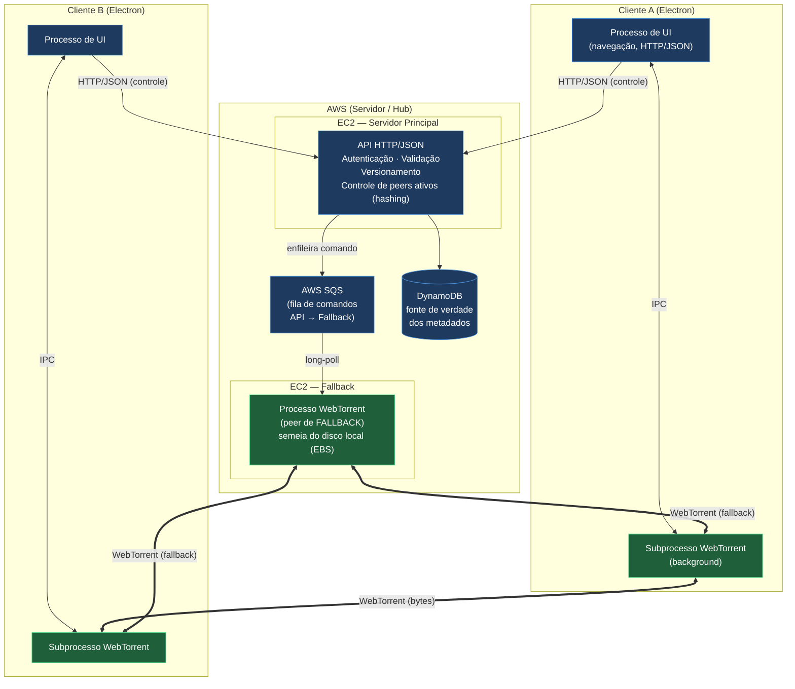
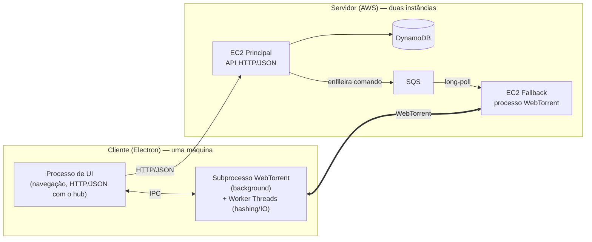
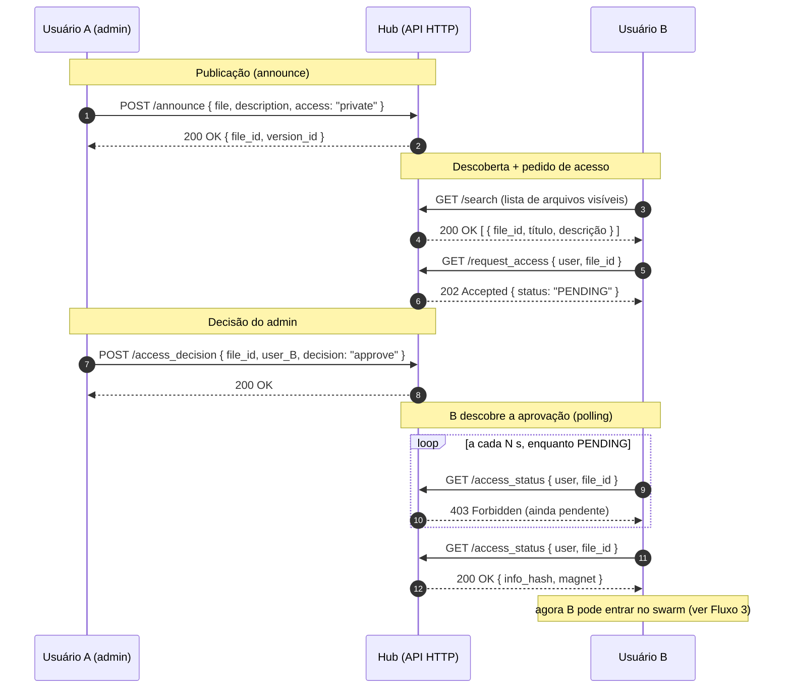
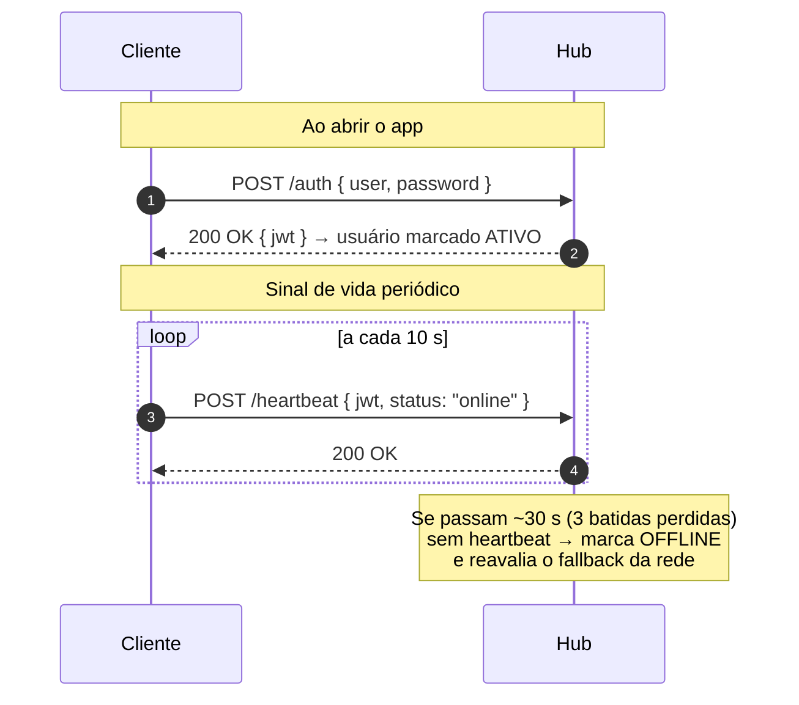
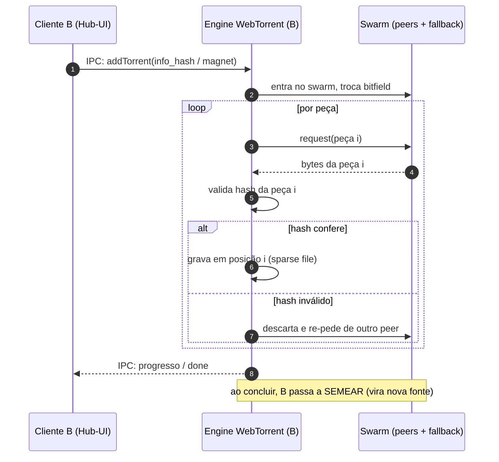
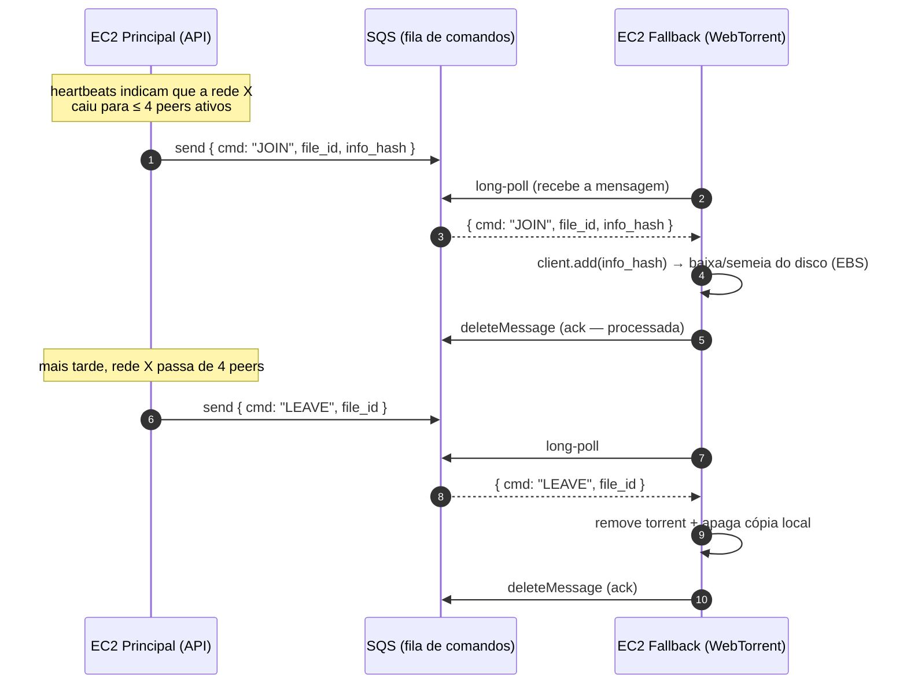
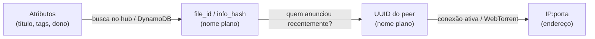
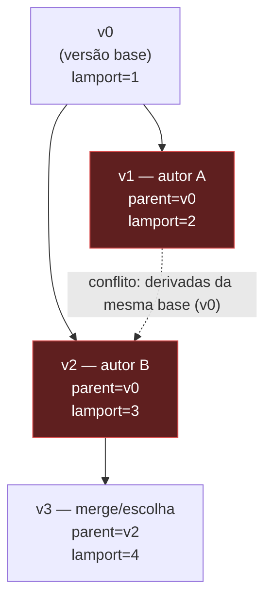
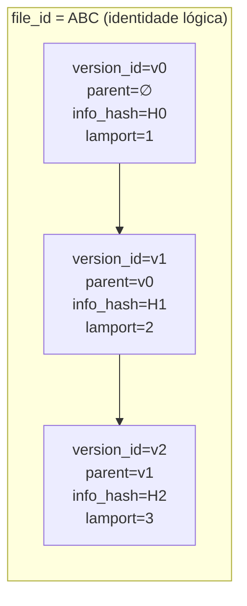
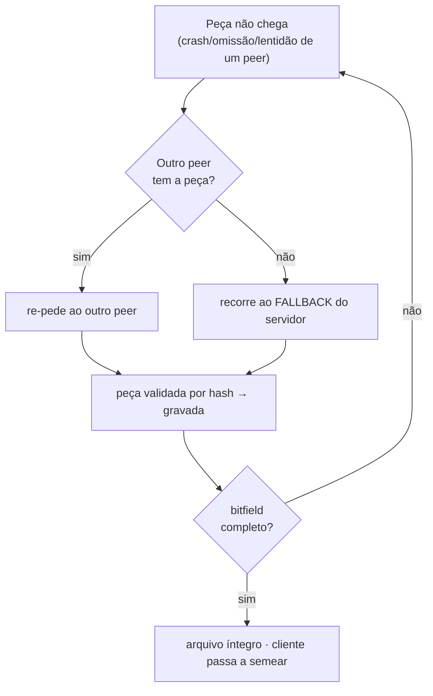

# Especificação de Sistema Distribuído
## Hub Central de Compartilhamento de Arquivos com Rede P2P (WebTorrent)

> **Disciplina:** ACH2147 - Desenvolvimento de Sistemas de Informação Distribuídos

Alunos:
- Davi Araujo Martins - 10337787
- Lucas Toupitzen Ferracin Garcia - 11804164
- Luís Henrique Fernandes Ramires - 13671998

---

## Sumário

1. [Visão Geral e Escopo](#1-visão-geral-e-escopo)
2. [Arquitetura](#2-arquitetura)
3. [Processos](#3-processos)
4. [Comunicação](#4-comunicação)
5. [Nomeação](#5-nomeação)
6. [Coordenação](#6-coordenação)
7. [Consistência](#7-consistência)
8. [Versionamento](#8-versionamento)
9. [Replicação](#9-replicação)
10. [Distribuição](#10-distribuição)
11. [Tolerância a Falhas](#11-tolerância-a-falhas)
12. [Segurança](#12-segurança)
13. [Trade-offs e Decisões de Projeto](#13-trade-offs-e-decisões-de-projeto)

---

## Glossário

| Termo | Significado no projeto |
|---|---|
| **Hub** | Servidor central (plano de controle). Hospeda a API HTTP, o banco de dados das redes e um processo WebTorrent de fallback. Hospedado via AWS EC2. |
| **Peer** | Qualquer cliente (app desktop) participando da rede P2P de um arquivo. |
| **Rede / swarm** | Conjunto de peers que compartilham **um único identificador de arquivo**. Uma rede pode ter vários arquivos, porém apenas um deles ativo. |
| **Seed (semear)** | Disponibilizar um arquivo (ou seus *shards*) para outros peers baixarem. |
| **Fallback** | O processo WebTorrent do servidor entrando como peer para garantir disponibilidade quando o swarm está pequeno. |
| **file_id** | Identidade **lógica** e estável de um arquivo, independente de versão. |
| **version_id** | Identidade de uma versão específica de um arquivo. |
| **Shard** | Pedaço (*piece*) de um arquivo, conforme o sharding do WebTorrent. |

---

## 1. Visão Geral e Escopo

### 1.1. O que é

O sistema é uma plataforma de **compartilhamento de arquivos** inspirada no BitTorrent,
porém com um **hub central** de navegação e controle. É **semi-descentralizado**:

- O **plano de controle** (descoberta de redes, autenticação, controle de acesso e
  metadados/versionamento) é **centralizado** no hub — arquitetura cliente-servidor.
- O **plano de dados** (transferência de bytes dos arquivos) é **descentralizado** —
  rede P2P sobre o protocolo **WebTorrent**.

A interface é um **aplicativo desktop** (Electron). O usuário navega pelo hub como se fosse
um "Google Drive compartilhado": vê as redes/arquivos existentes, publica arquivos, pede
acesso, baixa e atualiza versões.

> **Princípio organizador: 1 rede P2P = 1 arquivo ativo = n versões de arquivos.** Cada arquivo publicado define um
> swarm próprio, porém a rede apenas poderá compartilhar um único arquivo por vez. O administrador pode fazer upload de outros arquivos, que resultariam e em um novo arquivo ativo, com o anterior sendo deprecado. Um usuário pode participar simultaneamente de várias redes (uma por
> arquivo que esteja compartilhando ou baixando).

### 1.2. Propósito e ambiente

- **Ambiente controlado**, entre **usuários conhecidos**.
- O hub torna a **existência** de uma rede visível na interface; o **acesso ao conteúdo**
  é restrito por permissões (privado/público).
- **Objetivo central:** compartilhamento **simples e resiliente**, tolerante à
  indisponibilidade de peers, recorrendo a um **fallback no servidor** quando necessário.

### 1.3. Atores

| Ator | Papel |
|---|---|
| **Usuário logado** | Semeia o arquivo (íntegro e em *shards*); pode publicar novas versões; gerencia as sub-redes (permissões) do arquivo que administra. |
| **Usuário deslogado** | Não semeia; mantém localmente os arquivos/shards que já baixou e acessa apenas as versões que ele mesmo obteve. |
| **Administrador da rede** | Quem publica os arquivos; define acesso (privado/público) e modo de modificação (somente admin / colaborativo); aprova pedidos de acesso. |
| **Hub (servidor)** | Diretório, autenticador, fonte de verdade dos metadados e **peer de fallback** condicional. |

### 1.4. Requisitos não-funcionais priorizados

1. **Disponibilidade** (prioridade máxima) — o arquivo deve estar acessível mesmo com
   poucos ou nenhum peer humano online.
2. **Resiliência a falhas de peers** — desconexões no meio de uma transferência não podem
   inviabilizar o download.
3. **Integridade** — o conteúdo recebido deve ser exatamente o publicado (verificação por
   hash).
4. **Simplicidade de implementação** — escopo viável para um trabalho acadêmico em equipe.

> A consistência **forte** é explicitamente **sacrificada** em favor da disponibilidade
> (ver [§7](#7-consistência) e [§13](#13-trade-offs-e-decisões-de-projeto)).

---

## 2. Arquitetura

### 2.1. Visão de alto nível

O sistema separa claramente **plano de controle** (hub) e **plano de dados** (P2P):

- **Linhas azuis (controle):** HTTP/JSON, síncronas e temporárias (request/response).
- **Linhas verdes (dados):** WebTorrent, assíncronas e duradouras, transferindo bytes.

### 2.2. Componentes

| Componente | Hospedagem | Responsabilidade |
|---|---|---|
| **API (hub)** | **EC2 — Servidor Principal** | Autenticação/validação; índice de arquivos e redes; metadados e versionamento (fonte de verdade); controle de peers ativos por rede (tabela em memória + persistência). |
| **Processo WebTorrent (fallback)** | **EC2 — Fallback** (instância separada) | Peer de **fallback** que entra/sai das redes conforme o limiar de usuários (ver [§9](#9-replicação)); **semeia a partir do disco local (EBS)**. |
| **SQS** | AWS gerenciado | Fila durável de comandos da API para o Fallback ("entra na rede X" / "sai da rede Y"); ver [§4.5](#45-fluxo-4--comando-de-fallback-via-sqs). |
| **DynamoDB** | AWS gerenciado | Persistência dos metadados: usuários, arquivos, versões, permissões, *last-seen* dos peers. Banco distribuído e replicado entre AZs, com leitura *eventually*/*strongly consistent* configurável e *conditional writes*. |
| **Cliente** | Desktop (Electron) | App com **um processo de UI** (navegação, HTTP/JSON) e **um subprocesso WebTorrent em background** (peer). |

> **Nota sobre armazenamento do fallback:** o WebTorrent semeia a partir de um *filesystem*
> local — por isso o EC2 de fallback grava e serve o conteúdo a partir do **disco EBS** da
> própria instância, sem store de objetos intermediário.

### 2.3. Stack tecnológica

| Camada | Tecnologia | Justificativa |
|---|---|---|
| Cliente desktop | **Electron + TypeScript** | UI web (HTML/CSS), acesso nativo a filesystem via Node, multiplataforma. |
| Backend / Hub | **Node.js + TypeScript** | WebTorrent é um pacote npm maduro com exemplos comprovados em Node; dependências nativas funcionam sem atrito; **menor risco para o prazo** (ver [§13](#13-trade-offs-e-decisões-de-projeto)). |
| Persistência | **DynamoDB** | Banco distribuído gerenciado; consistência configurável (*eventual*/*strong*) e *conditional writes* — encaixam diretamente em Consistência ([§7](#7-consistência)) e no controle de concorrência do versionamento ([§6.3](#63-exclusão-mútua)). |
| Mensageria servidor↔servidor | **AWS SQS** | Fila durável entre o EC2 principal e o EC2 de fallback; o modelo de *long-polling* é coerente com a filosofia de polling do resto do sistema e sobrevive a reinício do fallback (ver [§4.5](#45-fluxo-4--comando-de-fallback-via-sqs)). |
| Transferência P2P | **WebTorrent** | Sharding, integridade por hash, signaling e NAT traversal já resolvidos pelo protocolo (ver [§10](#10-distribuição)). |
| Hospedagem | **AWS (2× EC2)** | EC2 principal (API/hub) + EC2 de fallback (WebTorrent), com IP público fixo (essencial para o hub atuar como ponto de descoberta e como seed de fallback). Duas instâncias separadas demonstram **falhas independentes** (ver [§11](#11-tolerância-a-falhas)). |

> **Tipos compartilhados:** como cliente e servidor são ambos TypeScript, as interfaces de
> mensagem (manifesto, versão, mensagens de controle) podem ser definidas **uma vez** e
> reaproveitadas dos dois lados, reduzindo erros de contrato.

---

## 3. Processos

A tocante de **processos** trata de como o trabalho é dividido em unidades de execução
concorrentes, do isolamento entre elas e da forma como cooperam.

### 3.1. Modelo de dois processos por lado

Tanto o cliente quanto o servidor adotam **separação de responsabilidades** em dois
processos distintos — mas com **acoplamentos diferentes** em cada lado: no cliente, os dois
processos são locais e conversam por **IPC**; no servidor, eles vivem em **duas instâncias
EC2 separadas** e conversam por uma **fila SQS**.

**Por que dois processos?**

- **Divisão clara de responsabilidades:** o processo de navegação (hub) e o de
  transferência (P2P) têm ciclos de vida e modelos de comunicação muito diferentes
  (síncrono/temporário vs assíncrono/duradouro). Separá-los nos ajuda a  evitar acoplamento indesejado.
- **Isolamento de falhas:** se o engine WebTorrent travar (alto uso de CPU/RAM ao
  verificar hashes de arquivos grandes), a UI continua responsiva. No servidor, o
  isolamento é ainda mais forte: API e fallback estão em **máquinas distintas**, então a
  queda de uma não derruba a outra, permitindo **falhas independentes**.
- **No cliente** (Electron):
    - **Processo de UI**: interface gráfica, ciclo de vida da aplicação e comunicação HTTP
      com o hub.
    - **Subprocesso WebTorrent (background)**: hospeda o engine WebTorrent, rodando de forma
      independente da UI.
- **No servidor** (AWS): a separação vira **distribuição física**, com EC2 principal sendo API +
  DynamoDB e a outra instância EC2 sendo de fallback, desacoplados por uma fila SQS (ver
  [§4.5](#45-fluxo-4--comando-de-fallback-via-sqs)).

### 3.2. Concorrência e processamento pesado

O ponto mais intensivo em CPU é o **hashing** (cálculo/verificação dos hashes das peças) e
o **I/O de disco**. Para não bloquear o laço de eventos:

- **Worker Threads** dedicadas para hashing (SHA por peça).
- **I/O assíncrono / double buffering**: a thread de rede preenche um buffer em RAM enquanto uma
  thread de disco drena as peças **já validadas** para o arquivo.
- **Sparse files / acesso aleatório**: como as peças chegam fora de ordem, o arquivo é
  aberto em modo de acesso aleatório e cada peça é escrita na posição
  `índice_da_peça × tamanho_da_peça`.
- **Thread pool limitado** (libuv) para evitar explosão de RAM.

> Boa parte desse trabalho já é feito **internamente pelo WebTorrent**; o projeto
> apenas configura limites (ex.: `maxConns`) e expõe o progresso para a UI.

### 3.3. Comunicação entre processos

Há dois acoplamentos distintos, cada um com o mecanismo apropriado à sua natureza:

| Acoplamento | Natureza | Mecanismo |
|---|---|---|
| **Cliente: UI ↔ subprocesso WebTorrent** | mesma máquina | **IPC nativo do Electron** (`ipcMain`/`ipcRenderer` / `MessageChannel`) |
| **Servidor: EC2 Principal → EC2 Fallback** | máquinas distintas | **fila AWS SQS** (long-polling) |

Para a comunicação **local** (cliente), um broker de mensagens
seria desnecessário por conta de sua complexidade, além do Electron também ter comunicação IPC nativa.
Já a comunicação **entre as duas máquinas do servidor** (EC2 principal e EC2 de fallback)
justifica uma **fila durável (SQS)**: ela sobrevive a um reinício do fallback (evitando
a perda da mensagem) e desacopla os dois processos.
[§6.4](#64-sqs-ponto-a-ponto-e-ausência-de-pubsub-e-eleição).

### 3.4. Virtualização e isolamento

- O **Electron** não virtualiza, porém faz **isolamento de processos / sandboxing** (Chromium +
  runtime Node sobre o kernel do SO, sem abstração de hardware).
- A **virtualização** propriamente dita aparece nas **instâncias EC2** (hypervisor da AWS
  fatiando hardware físico em RAM/CPU isolados), contribuindo para a disponibilidade do
  servidor. O uso de **duas instâncias** ainda reforça o isolamento de falhas entre API e
  fallback.
- A rede P2P forma uma **overlay network**: peers em redes físicas distintas (ex.: Wi-Fi de
  um campus vs 4G) se enxergam por identificadores lógicos (UUID/info_hash), não por
  topologia física, como uma virtualização de rede em estilo SDN simplificado.

---

## 4. Comunicação

### 4.1. Dois paradigmas de comunicação

O sistema usa **dois estilos de comunicação claramente distintos**, um por plano:

| Característica | Com o **Hub** (controle) | Com os **Peers** (dados) |
|---|---|---|
| Protocolo | HTTP | WebTorrent (sobre TCP/UDP/WebRTC) |
| Formato | **JSON** | **Binário** (bytes / peças) |
| Sincronia | **Síncrona** (request/response) | **Assíncrona** (orientada a eventos) |
| Duração | **Temporária** (curta, por requisição) | **Duradoura** (conexão persistente/stateful) |
| Bloqueante? | Não (UI non-blocking; o usuário continua navegando) | Não (eventos: `download`, `done`, ...) |

### 4.2. Fluxo 1 — Publicação e autorização de acesso

Quando um usuário publica um arquivo e outro pede acesso:

- Em **acesso público**, B já recebe o `info_hash` direto, sem passo de aprovação.
- A autorização é validada **100% no hub** (tabela de permissões: `user / file_id /
  status`); o `info_hash` só é entregue **após** a aprovação.
- A aprovação é **persistida**: se B sair e voltar depois, o hub não re-pergunta ao admin.

### 4.3. Fluxo 2 — Monitoramento de presença (heartbeat)

O hub precisa saber **quais peers estão ativos** em cada rede para (a) listar fontes e
(b) decidir quando ativar o fallback.

- **Heartbeat a cada 10s:** o hub só considera o peer **offline após ~30 s** sem sinal
  (3 batidas perdidas).
- Esse intervalo de tolerância trata **falhas de omissão** (um pacote de heartbeat perdido
  não derruba o peer da lista) sem gerar falso-positivo, e ainda assim aciona o fallback
  rapidamente quando o peer realmente cai.
- O hub mantém a lista de **peers ativos em memória** (estado "quente") e sincroniza com o
  banco periodicamente, onde a lista em RAM é a fonte para roteamento; o banco serve para
  auditoria/recuperação.

### 4.4. Fluxo 3 — Download P2P

- A UI dispara o download via **IPC**; o engine cuida do resto e devolve progresso por
  eventos.
- Cada peça é **verificada por hash** antes de ser escrita (ver [§7](#7-consistência) e
  [§12](#12-segurança)).
- Ao concluir, o cliente passa a **semear**, aumentando a disponibilidade da rede.

### 4.5. Fluxo 4 — Comando de fallback via SQS

Quando o número de peers ativos de uma rede cruza o limiar ([§9.2](#92-fallback-por-limiar--o-mecanismo-central)),
o EC2 principal precisa mandar o EC2 de fallback **entrar** ou **sair** daquele swarm. Como
são máquinas distintas, isso passa por uma **fila SQS**:

- **Por que uma fila, e não chamada direta?** Se o fallback estiver reiniciando ou ocupado,
  a mensagem **fica na fila** e é processada quando ele voltar, sendo nada perdido. A entrega
  *at-least-once* do SQS combina com operações **idempotentes** (entrar num swarm em que já
  se está, ou sair de um do qual já se saiu, são no-ops seguros).
- **Ack explícito:** a mensagem só é removida da fila após o fallback confirmar o
  processamento (`deleteMessage`), garantindo que um crash no meio do comando não perca a
  ordem.
- O modelo de **long-polling** do consumidor é coerente com a filosofia de *polling* usada
  no resto do sistema (autorização — [§4.2](#42-fluxo-1--publicação-e-autorização-de-acesso)).

---

## 5. Nomeação

A nomeação define **como entidades são identificadas e resolvidas** para um endereço.

### 5.1. Tipos de nome

| Entidade | Nome | Tipo |
|---|---|---|
| Arquivo (identidade lógica) | `file_id` | Identificador plano, estável entre versões |
| Versão de um arquivo | `version_id` | Identificador plano |
| Conteúdo de uma versão | `info_hash` | Identificador **derivado do conteúdo** (hash) |
| Peer | `UUID` | Identificador plano, independente de localização |
| Endereço de rede do peer | `IP:porta` | Endereço (volátil) |
| Atributos de busca | título, tags, descrição, dono | Nomeação **baseada em atributos** |

### 5.2. Indireção de nomes (resolução em camadas)

A grande ideia deste projeto é o uso da **indireção**: o usuário busca por atributos, e o sistema resolve, passo
a passo, até o endereço físico, sem que o usuário jamais precise saber o IP de ninguém.

1. **Atributos → info_hash:** busca no índice do hub (consulta ao DynamoDB por título/tags).
2. **info_hash → UUID:** o hub sabe (na lista em RAM) quais peers anunciaram aquele
   conteúdo recentemente.
3. **UUID → IP:porta:**  resolvido apenas no momento do *handshake* P2P (o IP fica
   mascarado por trás do UUID até então, ver [§12](#12-segurança)).

### 5.3. Características da nomeação

- **Centralizada**: o hub é a fonte única de verdade da resolução (diferente do DNS
  recursivo). Simplicidade ao custo de ser um ponto único para *descoberta*.
- **Dinâmica**: o mapeamento `UUID → IP:porta` expira quando a conexão cai; o WebTorrent
  re-anuncia para atualizar. Um peer que troca de rede (Wi-Fi → 4G) tem seu mapeamento
  atualizado quase instantaneamente.
- **Transparência de localização**: nomes (UUID, info_hash) **não carregam** informação de
  localização física, habilitando uma *overlay network* descrita em [§3.4](#34-virtualização-e-isolamento).
- **Indireta**: a resolução entrega um **ponteiro** (peer/fonte), não o arquivo em si.

---

## 6. Coordenação

A coordenação trata de **ordenar eventos** e **regular o acesso concorrente** a recursos
compartilhados.

### 6.1. Relógios lógicos (ordenação de versões)

O sistema usa **relógios lógicos de Lamport** para ordenar as versões de um arquivo no hub.

- Cada nova versão recebe um **timestamp de Lamport** atribuído pelo hub no momento da
  publicação.
- Esse timestamp dá uma **ordem total** entre versões, usada como critério do
  *last-write-wins* (ver [§7](#7-consistência)).
- Não dependemos do relógio físico das máquinas (que pode estar dessincronizado) para
  decidir qual versão é "mais nova".

### 6.2. Detecção de concorrência (DAG de versões)

A ordenação de Lamport, sozinha, não revela se duas versões foram criadas **em paralelo**.
Para isso, usamos a estrutura que o versionamento já fornece: o `parent_version_id` forma
um **DAG (grafo acíclico dirigido) de versões**.

- **Regra de detecção:** se duas versões têm o **mesmo `parent_version_id`**, elas são
  **concorrentes** (foram derivadas da mesma base sem conhecer uma à outra, indicando conflito).
- O conflito é **registrado**, nunca descartado silenciosamente (ver [§7.3](#73-conflitos-ramos-visíveis--lww)).

### 6.3. Exclusão mútua

Há dois recursos que exigem regulação de acesso concorrente, com mecanismos distintos:

| Recurso | Mecanismo | Política |
|---|---|---|
| **Publicação de versão no hub** | Lock **no hub** | **FIFO:** publicações concorrentes do mesmo arquivo são serializadas na ordem de chegada. |
| **Diretório/arquivo durante transferência** | Lock **local pessimista** (no processo torrent) | Fecha o acesso ao diretório enquanto os dados estão sendo gravados, evitando leitura de arquivo parcial/corrompido. |

- O **lock FIFO no hub** garante que duas publicações simultâneas não corrompam a cadeia de
  versões, cada uma recebe seu `version_id` e `lamport_ts` de forma serializada.
- O **lock pessimista local** é apropriado porque, durante a montagem do arquivo (peças
  fora de ordem em *sparse file*), uma leitura concorrente veria lixo.

### 6.4. SQS ponto-a-ponto, ausência de pub/sub e de eleição

Decisões explícitas sobre os mecanismos de coordenação:

- **Fila ponto-a-ponto (SQS).** A comunicação entre o EC2 principal e o EC2 de
  fallback usa uma **fila SQS** ([§4.5](#45-fluxo-4--comando-de-fallback-via-sqs)): um
  produtor (API), um consumidor (fallback), entrega ponto-a-ponto. Optou-se por fila e não
  por barramento de eventos porque há **um único** consumidor e o objetivo é entrega
  confiável de comandos, sem difusão de mensagens. Um *SNS/pub-sub* só se justificaria nesse projeto com **vários**
  fallbacks recebendo o mesmo comando, o que foge do escopo atual do projeto.
- **Sincronização cliente↔hub por request/response + polling.** Nenhuma assinatura de
  eventos do lado do cliente: a autorização de acesso usa *polling* HTTP
  ([§4.2](#42-fluxo-1--publicação-e-autorização-de-acesso)), priorizando simplicidade.
- **Sem algoritmos de eleição.** Não há necessidade de eleger um líder: o hub é fixo (IP
  público no EC2 principal) e centraliza a coordenação. O papel de "seed garantido" é
  exercido pelo **fallback do servidor** de forma **determinística por limiar**
  ([§9](#9-replicação)), não por uma eleição entre peers. Isso evita a complexidade de
  Bully/Ring/Raft, que seria desproporcional ao escopo.

---

## 7. Consistência

### 7.1. Modelo: consistência eventual (lado AP)

O sistema adota **consistência eventual** e prioriza **disponibilidade**, posicionando-se
no lado **AP** do teorema CAP (ver [§13.1](#131-cap-por-que-ap)).

- O **hub é a fonte de verdade dos metadados** (catálogo de arquivos, versões, permissões,
  cadeia de versionamento). Os metadados no hub são consistentes entre si (escritas
  serializadas por lock FIFO).
- O **conteúdo dos arquivos** na rede P2P é **eventualmente consistente**: um peer (ou o
  fallback) pode, por um tempo, servir uma **versão anterior** até propagar a mais recente.

### 7.2. Imutabilidade por versão

A pedra angular da consistência aqui é a **imutabilidade**:

- Cada versão é **imutável**: seu conteúdo é identificado pelo `info_hash`.
- Uma "edição" **nunca** altera uma versão existente, ela cria uma **nova versão** com
  novo `info_hash` (ver [§8](#8-versionamento)).
- Isso elimina a classe de conflito "dois peers escrevendo no mesmo objeto": não há escrita
  in-place, só criação de novas versões imutáveis.

### 7.3. Conflitos: ramos visíveis + LWW

Quando dois usuários derivam versões concorrentes do mesmo *parent* (detectado pelo DAG, como visto em
[§6.2](#62-detecção-de-concorrência-dag-de-versões)):

- **Last-Write-Wins (LWW)** pela ordem de Lamport define a versão **"atual"** apresentada
  por padrão.
- Porém, **ambas as versões permanecem registradas**, **sem perda silenciosa**. O ramo
  perdedor fica **visível e selecionável** na interface.
- Em **modo centralizado**, o admin pode resolver o conflito escolhendo/promovendo um ramo;
  em **modo colaborativo**, os ramos coexistem visíveis até que alguém os concilie.

> Isso dá ao usuário a transparência de que houve concorrência, sem bloquear o fluxo

### 7.4. Integridade do conteúdo

- O hub mantém o **hash de cada peça** (estilo árvore de hashes). Ao receber uma peça, o
  peer **recalcula e compara**: se diverge, **descarta** e re-pede de outra fonte (e pode
  marcar o remetente como não-confiável).
- O cliente mantém um **bitfield**: o arquivo só é considerado **disponível/íntegro** quando
  **todas as peças** estão validadas.

### 7.5. Garantias de sessão

- **Read-your-writes (local):** uma versão que o usuário publicou ou baixou fica em
  **cache local**, garantindo que ele sempre a veja, independentemente do estado da rede.
- **Sincronização sob demanda:** o cliente **não** atualiza automaticamente, o usuário
  decide quando baixar a versão mais recente (clique de "atualizar"). Isso torna a
  defasagem **explícita e controlada** pelo usuário, em vez de silenciosa.

### 7.6. Recuperação de estado do hub

Se o hub reinicia, ele lê o DynamoDB, assume **todos os peers offline** e reconstrói a lista
de ativos em RAM conforme os heartbeats voltam a chegar (~15-30 s). Durante essa janela, o
estado de presença é **eventualmente** consistente, aceitável dado o modelo AP.

---

## 8. Versionamento

### 8.1. Identidade lógica vs física

O sistema **separa explicitamente** a identidade **lógica** do arquivo da sua
**representação física** na rede:

- **`file_id`:** identidade lógica e **estável** de um arquivo (não muda entre versões).
- **`info_hash`:** referência ao **conteúdo** de uma versão específica no protocolo
  BitTorrent (muda a cada versão).

### 8.2. Modelo de uma versão

Cada versão é composta por:

| Campo | Descrição |
|---|---|
| `version_id` | Identificador único da versão. |
| `parent_version_id` | Referência à versão anterior (forma o **DAG**; pode ser nulo na versão base). |
| `file_info_hash` | Hash do conteúdo (referência ao dado distribuído via WebTorrent). |
| `lamport_ts` | Timestamp lógico de Lamport, atribuído pelo hub (ordena para o LWW). |
| `author_id` | Quem criou a versão. |

### 8.3. Cada edição = nova versão

- Alterar um arquivo **não** muda o conteúdo existente; gera uma **nova versão** com novo
  `info_hash` (o conteúdo mudou, logo o hash muda).
- Os **metadados centralizados no hub são a fonte de verdade**, permitindo: rastreamento de
  histórico completo e **detecção de conflitos** via DAG.

### 8.4. Modos de atualização

| Modo | Quem pode publicar nova versão | Conflito |
|---|---|---|
| **Centralizado** | Apenas o **administrador** do arquivo. | Praticamente não ocorre (escritor único); admin resolve se houver. |
| **Colaborativo** | **Múltiplos usuários** autorizados. | Pode gerar versões concorrentes (ramos visíveis + LWW, [§7.3](#73-conflitos-ramos-visíveis--lww)); o risco é assumido conscientemente. |

### 8.5. Propagação sob demanda

A nova versão **não é empurrada** para quem tem a versão antiga. Os peers continuam
servindo a versão que possuem; um usuário só recebe a versão nova quando **escolhe**
atualizar. Isso é o que torna possível que peers/fallback sirvam versões antigas
temporariamente (consistência eventual, [§7](#7-consistência)).

---

## 9. Replicação

### 9.1. Estratégia: replicação passiva e sob demanda

A replicação no sistema tem **duas fontes**:

1. **Replicação natural do P2P:** cada peer que baixa um arquivo passa a semeá-lo,
   replicando o conteúdo organicamente pelo swarm.
2. **Replicação no servidor (fallback):** o processo WebTorrent do servidor entra como
   peer para garantir um mínimo de disponibilidade.

### 9.2. Fallback por limiar: o mecanismo central

O servidor entra e sai das redes conforme o **número de usuários ativos**:

- **Limiar:** ≤ 4 usuários ativos → o servidor **entra** como peer e semeia; > 4 → o
  servidor **sai e apaga** sua cópia local.
- **Fator de replicação dinâmico:** redes pequenas ganham +1 réplica garantida (o
  servidor); redes grandes dispensam o servidor porque já têm réplicas suficientes entre os
  peers.

### 9.3. Cache local do cliente

Cada cliente mantém localmente as **versões que baixou**, funcionando como um terceiro
nível de disponibilidade (P2P → fallback do servidor → cache local) e garantindo
*read-your-writes* ([§7.5](#75-garantias-de-sessão)).

### 9.4. Limitação assumida

O fallback **não garante** ter sempre a versão **mais recente** (consequência direta da
propagação sob demanda, veja em [§8.5](#85-propagação-sob-demanda)). Em troca, garante que o
conteúdo **exista** em algum lugar acessível mesmo sem peers humanos online. É uma troca
**disponibilidade × atualidade** que decidimos assumir.

---

## 10. Distribuição

### 10.1. Protocolo: WebTorrent

A distribuição dos dados usa o protocolo **WebTorrent** (BitTorrent sobre WebRTC/TCP/UDP),
acessado pela API homônima.

### 10.2. Por que WebTorrent (e não WebRTC manual)

A escolha foi motivada por **reduzir a complexidade da camada de rede**. O protocolo já
resolve, de forma consolidada e testada:

| Problema de SD | Como o WebTorrent resolve |
|---|---|
| Descoberta/conexão entre peers | Signaling e **NAT traversal** embutidos (hole punching). |
| Dividir arquivos grandes | **Sharding** automático em peças. |
| Integridade | **Hash por peça:** peça inválida é descartada e re-pedida. |
| Eficiência de distribuição | *Swarming*/multi-fonte: baixa peças diferentes de peers diferentes em paralelo. |
| Disponibilidade parcial | Um peer pode re-compartilhar a peça 1 antes de ter o arquivo inteiro. |
| Controle de fluxo | Backpressure e *piece selection* internos. |

### 10.3. Papel do servidor na distribuição

O servidor participa como **peer de fallback** (uma espécie de *web seed* / "seeder de
última instância"): uma fonte alternativa de download e o mecanismo de recuperação quando
o P2P entre humanos falha. Sua presença é **condicional ao limiar** ([§9.2](#92-fallback-por-limiar--o-mecanismo-central)).

---

## 11. Tolerância a Falhas

### 11.1. Postura: disponibilidade acima de confiabilidade

Coerente com a escolha **AP**, o sistema prioriza **disponibilidade** sobre confiabilidade
forte. Aceita-se servir, ocasionalmente, uma **versão desatualizada** (mas íntegra), desde
que o sistema **continue respondendo**. A integridade do que é entregue é sempre garantida
por hash; a *atualidade* é que é relaxada.

### 11.2. Classes de falha tratadas

| Classe | Tratada? | Como |
|---|---|---|
| **Crash** (peer ou hub param) | Sim | Heartbeat + timeout; fallback do servidor; re-request de peças a outras fontes; recuperação de estado do hub via DynamoDB. Como API e fallback estão em **EC2 separados**, a queda de um não derruba o outro. |
| **Omissão** (mensagem/heartbeat perdido) | Sim | Tolerância de 3 batidas (~30 s) antes de marcar offline; WebTorrent re-pede peças não recebidas; retry de requisições HTTP. |
| **Temporização** (peer lento) | Parcial | *Swarming* prioriza peers rápidos; timeout cai no fallback. |
| **Bizantina** (peer malicioso) | Fora de escopo | Mitigação **parcial** apenas contra **corrupção** de conteúdo, via hash por peça. Ataque ativo coordenado é declarado **trabalho futuro**. |

### 11.3. Mapa falha → detecção → recuperação

Mapeando as **quatro falhas previstas** no design original:

| # | Falha | Detecção | Recuperação |
|---|---|---|---|
| 1 | **Peer indisponível no meio da transação** | Timeout na requisição de peça | Re-pede a peça a outro peer no swarm; se ninguém tem, recorre ao **fallback**. |
| 2 | **Peer desconecta no meio de um download** | Conexão cai / bitfield incompleto | WebTorrent busca as peças faltantes em outras fontes; o download **retoma de onde parou** (peças já validadas ficam gravadas no *sparse file*). |
| 3 | **Hub cai e não há mais arquivos para acesso** | Cliente não obtém resposta da API | Conteúdo **já em redes ativas continua disponível** via P2P (plano de dados independe do hub no momento da transferência); ao voltar, o hub reconstrói o estado de presença pelos heartbeats. A **descoberta** de novas redes fica indisponível durante a queda (limitação aceita do modelo). |
| 4 | **Usuário baixa versão antiga** | Comparação de `lamport_ts`/`version_id` com o hub | Não é tratado como erro, e sim como **comportamento esperado** (consistência eventual); o usuário pode **atualizar sob demanda** quando desejar a versão mais recente. |

### 11.4. O fallback como mecanismo central de tolerância

O **fallback do servidor** é o principal mecanismo de tolerância a falhas de
disponibilidade: ele garante que, mesmo que **todos os peers humanos** de uma rede pequena
fiquem offline, exista **pelo menos uma fonte** do conteúdo (cold-start e recuperação). É o
elo entre as tocantes de **Replicação** ([§9](#9-replicação)) e **Tolerância a Falhas**.

---

## 12. Segurança

Escopo de segurança calibrado para ser **robusto e viável** no prazo: **TLS + JWT + hash
por peça**. (Criptografia ponta-a-ponta do conteúdo é **trabalho futuro**.)

### 12.1. Camadas

| Camada | Mecanismo |
|---|---|
| **Transporte com o hub** | **HTTPS/TLS:** toda a comunicação de controle é cifrada. |
| **Autenticação** | **JWT:** o cliente autentica (`POST /auth`) e recebe um token; requisições subsequentes (heartbeat, request_access, etc.) o apresentam. |
| **Controle de acesso** | Validação **100% no hub**: tabela de permissões `user / file_id / status`; arquivos **privados** exigem aprovação do admin antes de liberar o `info_hash`. |
| **Integridade / anti-poisoning** | **Hash por peça:** peça corrompida ou forjada é descartada e re-pedida; protege contra *poisoning* do swarm. |
| **Privacidade de endereço** | **UUID / "blind exchange":** o hub nunca devolve IPs a usuários não-autorizados; retorna o **UUID** do peer, e o `IP:porta` só é exposto no *handshake* P2P (comportamento intrínseco do P2P). |

### 12.2. Limites assumidos

- Em P2P real, o peer **conectado** inevitavelmente conhece o IP do outro (o cabeçalho do
  pacote precisa do destino). Isso é mitigado, não eliminado: identidade por UUID, liberação
  só após autorização, e **conteúdo cifrado em trânsito** (DTLS/SRTP nativos do
  WebRTC/WebTorrent) tornam o tráfego ilegível a interceptadores.
- **Não** há criptografia da carga **em repouso** no fallback nesta versão. A alternativa
  mais forte, sendo o cliente cifrar o conteúdo **antes** de semear (E2EE), com o servidor
  guardando apenas o blob cifrado, chegou a ser considerado como uma evolução futura

---

## 13. Trade-offs e Decisões de Projeto

### 13.1. CAP: por que AP

O sistema foi projetado priorizando **disponibilidade em detrimento de consistência forte**,
adotando **consistência eventual**. A decisão é reforçada pela própria mecânica do fallback:
o servidor injeta disponibilidade **exatamente** quando o swarm é frágil. Sob partição, o
**conteúdo já em redes ativas continua acessível** (plano de dados P2P); o que degrada é a
**descoberta de novas redes** (depende do hub), sendo uma limitação aceita pelo grupo.

### 13.2. Tabela consolidada de decisões

| # | Decisão | Alternativa descartada | Justificativa |
|---|---|---|---|
| 1 | **AP** (disponibilidade + consistência eventual) | C+A / consistência forte | Caso de uso é compartilhamento resiliente; servir versão antiga (íntegra) é aceitável; indisponibilidade não é. |
| 2 | **Fallback por limiar** (≤4 entra, >4 apaga) | Servidor seed permanente | Economiza armazenamento (EBS) no EC2; replica **onde realmente precisa** (redes pequenas); coerente com AP. |
| 3 | **Node.js** no backend | Bun | WebTorrent maduro em npm; deps nativas sem atrito; menor risco no prazo. |
| 4 | **WebTorrent** | WebRTC manual (Simple-Peer) | Sharding, integridade, NAT traversal e flow control prontos; foca o esforço nas tocantes de SD. |
| 5 | **Lamport + DAG** | Relógios vetoriais | Mesma capacidade de detectar concorrência (via `parent_version_id`) com muito menos complexidade. |
| 6 | **Ramos visíveis + LWW** | LWW silencioso | Sem perda de dados; transparência do conflito ao usuário; não bloqueia o fluxo. |
| 7 | **SQS (fila ponto-a-ponto)** servidor↔servidor | SNS/pub-sub; chamada HTTP direta | Entrega durável que sobrevive a restart do fallback; um só consumidor não pede fan-out; long-poll é coerente com a filosofia de polling. |
| 8 | **IPC nativo** no cliente | Broker (RabbitMQ) | Comunicação local UI↔WebTorrent não precisa de infra externa; menor consumo de RAM. |
| 9 | **2× EC2** (API + fallback separados) | 1 EC2 com 2 processos | Demonstra **falhas independentes**; custo extra desprezível na janela de POC (ver [§13.4](#134-infraestrutura-e-custos-da-poc)). |
| 10 | **DynamoDB** | SQLite / relacional | Banco distribuído gerenciado; consistência configurável e *conditional writes* encaixam em Consistência e no controle de concorrência. |
| 11 | **Sem eleição** | Bully / Ring / Raft | Hub fixo centraliza coordenação; "seed garantido" é determinístico por limiar, não eleito. |
| 12 | **Heartbeat 10 s / timeout 30 s** | 10 s estrito ou 30 s estrito | 10 s detecta queda cedo; tolerância de 30 s (3 batidas) absorve falhas de omissão sem falso-positivo. |
| 13 | **TLS + JWT + hash por peça** | E2EE completa | Cobre as ameaças relevantes no prazo; E2EE fica como trabalho futuro. |

### 13.3. Limitações conhecidas e trabalho futuro

- **Ponto único para descoberta:** o hub é centralizado; sua queda interrompe a descoberta
  de novas redes (embora as transferências em curso sobrevivam). Mitigável no futuro com
  réplicas do hub + balanceador.
- **Atualidade do fallback:** o servidor pode servir versões antigas (propagação sob
  demanda).
- **Durabilidade do fallback na POC:** o conteúdo do fallback vive no **EBS** do EC2; um
  *terminate* da instância o apaga. Um **bucket S3** como backup durável é trabalho futuro.
- **Segurança de conteúdo em repouso:** E2EE não implementada neste projeto.
- **Falhas bizantinas:** apenas mitigação parcial (corrupção), não ataque coordenado.

### 13.4. Plano de validação e riscos

Ordem recomendada de validação, do maior risco para o menor:

1. **Transporte P2P (risco #1):** subir 1 EC2 com WebTorrent em Node e fazer 1 cliente
   Electron baixar **um arquivo**. Começar por **TCP/uTP** (EC2 tem IP público → cliente↔
   servidor sempre conecta); só subir para **WebRTC + WebSocket tracker** se o cenário
   cliente↔cliente entre redes diferentes for necessário para a demo.
2. **Fila de comando:** validar o ciclo API → SQS → fallback (JOIN/LEAVE) com mensagens
   idempotentes e ack.
3. **Persistência:** modelar as tabelas DynamoDB pelos padrões de acesso (pega por
   `file_id`, lista redes, lista peers ativos) e validar *conditional write* na publicação.
4. **Fluxo ponta-a-ponta:** publicar → descobrir → autorizar (polling) → baixar → fallback
   entra ao cair abaixo do limiar.

---

> **Resumo de uma linha:** um hub central consistente coordena descoberta, identidade e
> versionamento, enquanto uma rede P2P (WebTorrent) eventualmente consistente entrega os
> bytes, com um servidor-peer de fallback por limiar garante que a disponibilidade nunca
> chegue a zero.
